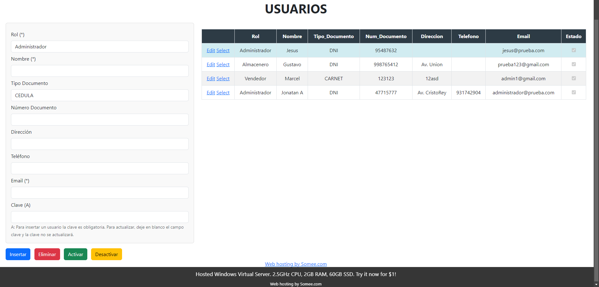
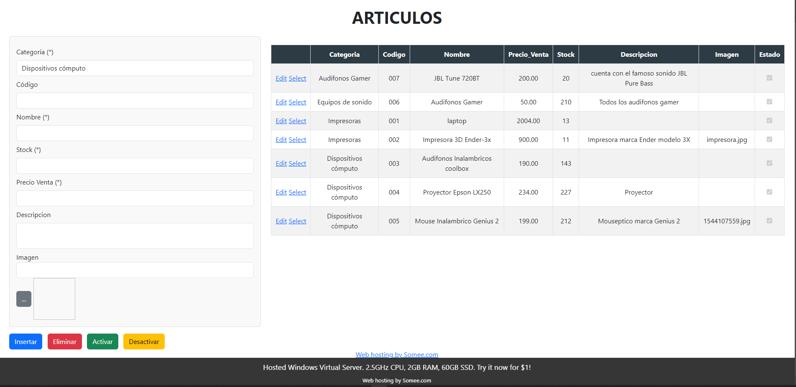
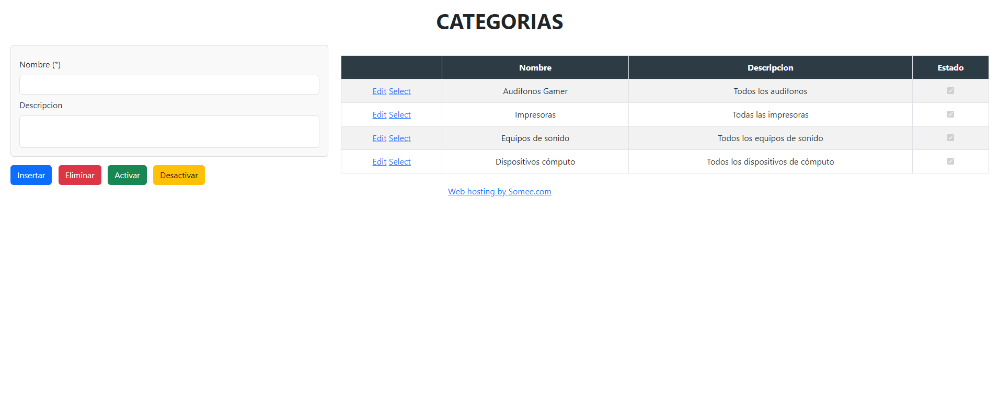
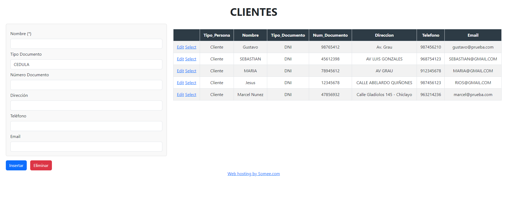
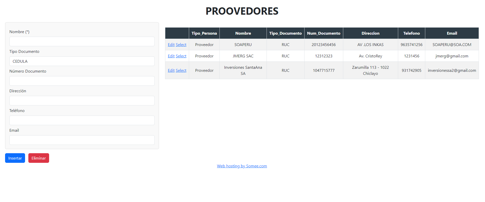
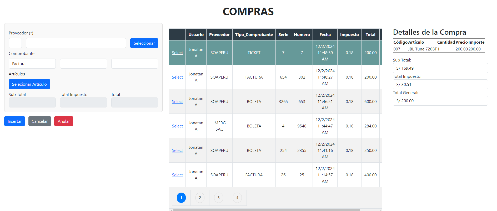

# Sistema de Compra y Venta de Tecnología - JMERG

Este es un sistema de gestión desarrollado utilizando ASP.NET para la capa de presentación y SQL Server para la gestión de datos. El sistema incluye módulos para Login, Usuarios, Artículos, Categorías, Clientes, Proveedores, Compras y Ventas.
## Páginas del sistema
## Página de Login

El módulo de Login asegura que solo usuarios autorizados puedan acceder al sistema. Implementa autenticación y seguridad de datos.

## Página de Usuarios

Este módulo permite la administración de usuarios. Se pueden agregar, editar, y eliminar usuarios, así como asignar roles y permisos.

## Página de Artículos

En este módulo se maneja la información relacionada con los artículos que la empresa comercializa. Incluye detalles como nombre, descripción, precio y stock.

## Página de Categorías

Las categorías permiten organizar los artículos en grupos para facilitar su gestión y búsqueda.

## Página de Clientes

Este módulo administra la información de los clientes, permitiendo registrar, actualizar y buscar clientes.

## Página de Proveedores

Gestiona la información de los proveedores desde donde se adquieren los artículos.

## Página de Compras

Permite registrar y gestionar las compras a proveedores, incluyendo el seguimiento de pedidos y pagos.

## Página de Ventas

Este módulo maneja todo lo relacionado con las ventas a clientes, desde la creación de pedidos hasta la facturación y el cobro.
## Características técnicas
- **Framework Backend**: ASP.NET
- **Base de Datos**: SQL Server
- **Autenticación y Seguridad**: Implementada en el módulo de Login
